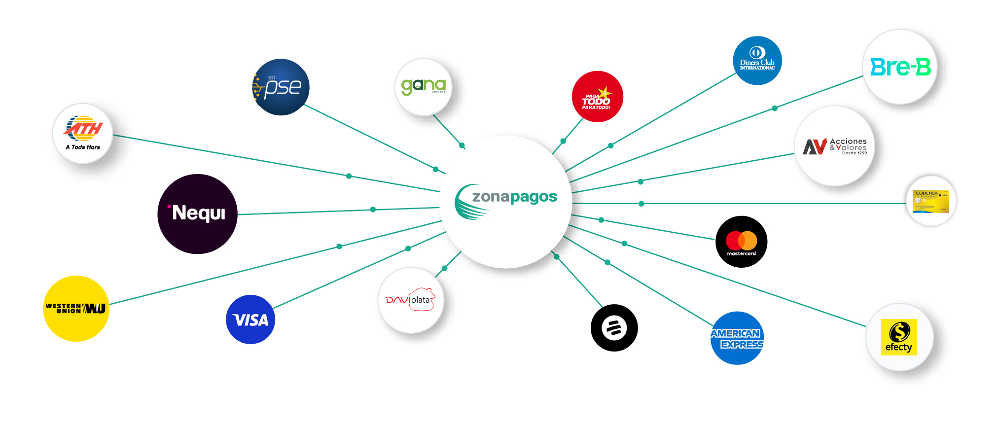
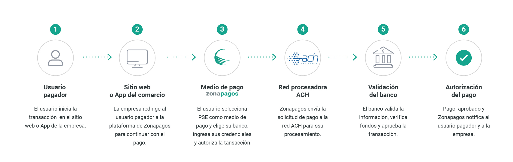
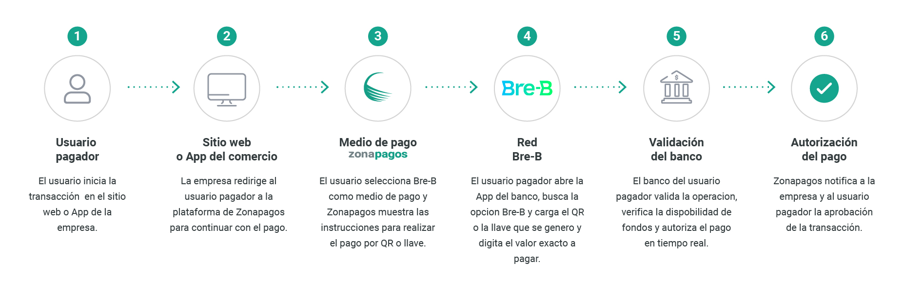
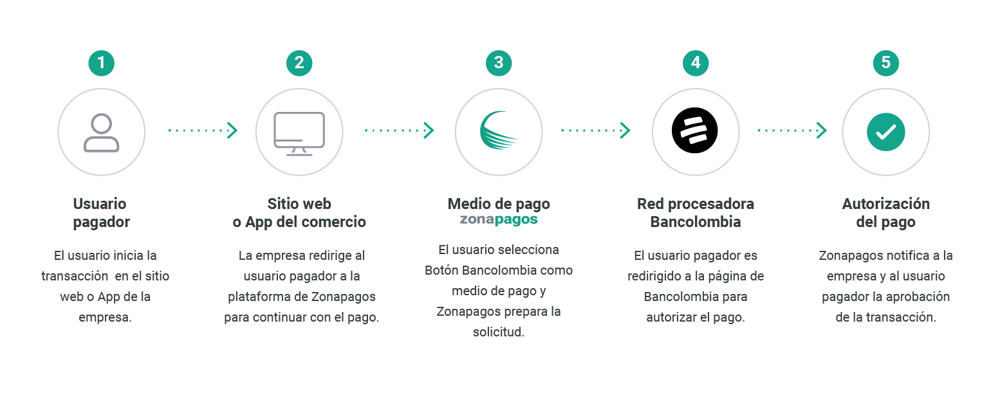
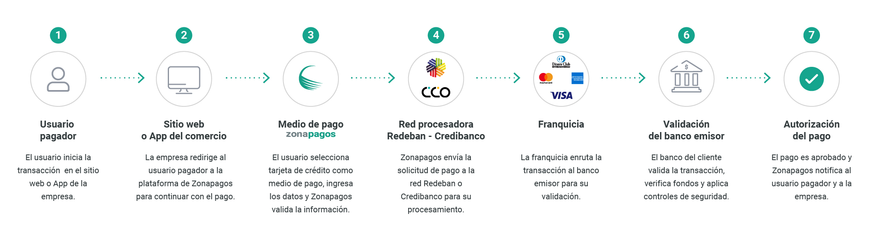
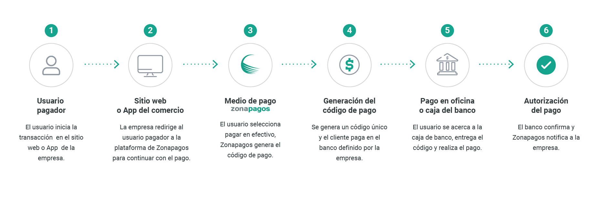
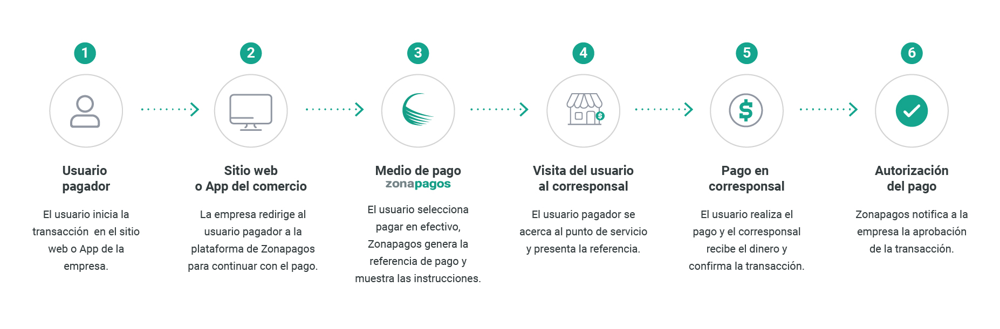
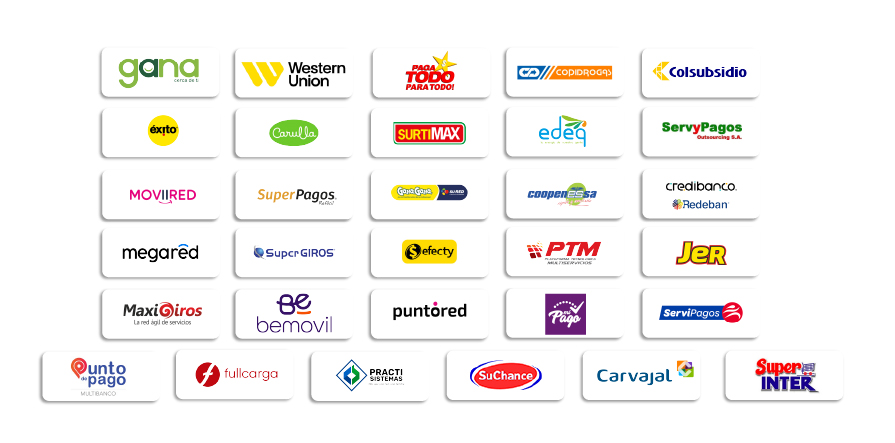

Dependiendo del servicio contratado, Zonapagos permite habilitar diferentes medios de pago, como transferencias bancarias, tarjetas, experiencias de pago alojadas y soluciones de recaudo digital.

  

## 1. Medios digitales
Permiten a los usuarios realizar pagos en línea desde dispositivos móviles o navegadores web, con validación en tiempo real.
### Medios disponibles:
-	PSE (Pagos Seguros en Línea) 
-	Bre-B 
-	Daviplata 
-	Nequi 
-	Botón Bancolombia 
-	Tarjetas de crédito 

**Características**
-	Procesamiento en línea con validación inmediata. 
-	Integración directa en flujos web o móviles. 
-	Amplia cobertura de entidades financieras. 
-	Experiencia de pago digital centralizada. 

**Consideraciones técnicas**
-	Algunos medios pueden requerir redirección a entidades externas. 
-	La disponibilidad depende de la configuración del comercio.

### PSE (Pagos Seguros en Línea)
Débito directo desde cualquier cuenta de ahorros o corriente en Colombia.

  

### Bre-B
Sistema de Pagos Inmediatos del Banco de la República: el cliente copia la llave del comercio, abre la app de su banco o billetera y completa el pago en segundos.

  

### Botón Bancolombia
Opción de transferir dinero de manera más rápida y segura entre cuentas Bancolombia.

  

### Tarjetas de crédito y débito
Pagos con las principales franquicias Visa, Mastercard, American Express y Diners Club. 3DS Secure brinda para mayor protección y reducción de fraudes.

  

## 2. Oficinas bancarias
Permite realizar pagos en efectivo directamente en sucursales bancarias como BBVA, Davivienda, Bancolombia y otras entidades financieras, una opción conveniente para quienes prefieren gestionar sus transacciones de manera presencial. 
Este modelo está orientado a usuarios que prefieren o requieren atención física para completar sus pagos.

  

**Características**
-	Pago presencial en entidades bancarias.
-	Generación de referencias o comprobantes de pago. 
-	Aplicación del pago posterior a la confirmación bancaria.

**Casos de uso**
-	Pagos de alto valor.
-	Usuarios no digitales.
-	Procesos institucionales o empresariales. 

## 3. Canales no bancarizados
Los corresponsales bancarios permiten recibir pagos en efectivo a través de una amplia red de puntos de servicio, como Gana, SuperGIROSy Wester Union, brindando accesibilidad a usuarios sin cuenta bancaria. Además, garantiza una cobertura amplia a nivel nacional.

  

**Canales disponibles:**
-	Gana 
-	Efecty 
-	Western Union 
-	SuperGIROS 
-	ATH 
-	Otros aliados autorizados 

  

**Características**
-	Cobertura amplia en puntos físicos a nivel nacional.
-	Acceso a usuarios no bancarizados.
-	Pago mediante referencia o código generado. 

**Casos de uso**
-	Recaudo en zonas con baja bancarización.
-	Pagos en efectivo.
-	Servicios masivos o de alto volumen. 

**Consideraciones técnicas**
-	Requiere generación de una referencia de pago.
-	Integración con procesos de conciliación posterior.

**Habilitación de medios de pago**
La activación de cada medio de pago depende de:
-	Configuración comercial con Zonapagos 
-	Tipo de servicio implementado Zonaexpress,Zonapay, Zonarecaudo, etc. 
-	Canal de recaudo web, físico, QR, etc.
-	Requisitos regulatorios o bancarios 

## Resumen
Zonapagos ofrece una combinación de medios de pago phigytal, presenciales y alternativos que permiten a los comercios adaptar su estrategia de recaudo a diferentes tipos de 
usuarios y contextos operativos.

