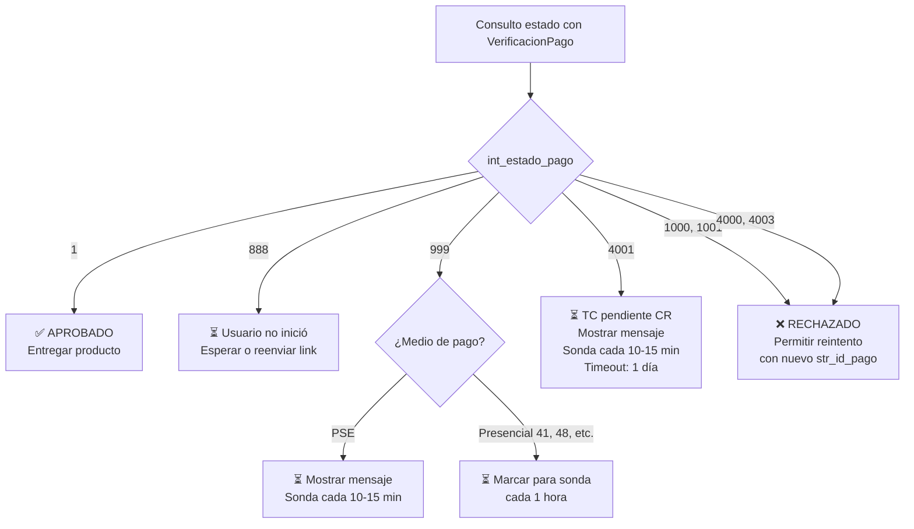

Este es el campo más importante de toda la respuesta de `VerificacionPago`. Se encuentra dentro de `str_res_pago` en la posición 5.

## Tabla consolidada

| Estado | Código | Medio | Descripción | Acción recomendada |
|--------|--------|-------|-------------|-------------------|
| <Icon icon="circle-check" color="#10B981" /> **Aprobado** | `1` | Todos | Pago finalizado exitosamente. | Entregar producto. Enviar confirmación al cliente. |
| <Icon icon="clock" color="#F59E0B" /> **Pendiente por iniciar** | `888` | Todos | Usuario no ha abierto aún el ciclo de pago. | Esperar. Reenviar link si es necesario. |
| <Icon icon="clock" color="#F59E0B" /> **Pendiente por finalizar** | `999` | PSE / presencial | PSE/banco no ha confirmado. | Mostrar mensaje obligatorio al usuario (ver [Mensajes de certificación](/docs/zonapay/guias/certificacion-pse)). Consultar desde la sonda. |
| <Icon icon="clock" color="#F59E0B" /> **Pendiente CR** | `4001` | TC | Franquicia retuvo para revisión manual. | Mostrar mensaje al usuario. Consultar desde la sonda. Tiempo máximo: 1 día y fracción. |
| <Icon icon="circle-xmark" color="#EF4444" /> **Rechazado** | `1000` | Todos | Banco/franquicia rechazó la transacción. | Marcar pedido como rechazado. Permitir reintento con nuevo `str_id_pago`. |
| <Icon icon="circle-xmark" color="#EF4444" /> **Error ACH/Banco** | `1001` | PSE | Error en comunicación ACH-Banco (se trata como rechazado). | Igual que `1000`. |
| <Icon icon="circle-xmark" color="#EF4444" /> **Rechazado CR** | `4000` | TC | Franquicia rechazó tras revisión. | Marcar rechazado. |
| <Icon icon="circle-xmark" color="#EF4444" /> **Error CR** | `4003` | TC | Error en el proceso CR (equivale a rechazo). | Marcar rechazado. |

## Estados en detalle

### `1` — Aprobado ✅

El pago fue exitoso. `int_pago_terminado` también será `1`.

<Check>Actualizar pedido a "pagado" en tu base de datos.</Check>
<Check>Entregar producto o activar servicio.</Check>
<Check>Enviar email de confirmación (ZonaPagos envía el comprobante de pago; tu correo confirma la entrega del producto).</Check>
<Check>Registrar en logs con el `str_ticketID` / `str_codigo_transaccion` (CUS) para conciliación.</Check>

### `888` — Pendiente por iniciar

El usuario aún no ha abierto la `str_url` del ciclo de pago. No hizo nada todavía.

<Info>
Es el estado natural tras llamar `/InicioPago` y antes de que el usuario haga clic. Si después de 30 minutos sigue en `888`, asume que el usuario abandonó.
</Info>

### `999` — Pendiente por finalizar (PSE / presencial)

La transacción fue iniciada y enviada a la red de pagos, pero aún no llega confirmación definitiva.

<Warning>
**Requerimiento de certificación PSE:** si este estado se mantiene cuando consultas tras el callback, **debes mostrar al usuario un mensaje específico**. Ver [Mensajes de certificación](/docs/zonapay/guias/certificacion-pse).

Mensaje obligatorio:

> *"En este momento su Número de Referencia o Factura (id_Pago) presenta un proceso de pago cuya transacción se encuentra PENDIENTE de recibir confirmación por parte de su entidad financiera, por favor espere unos minutos y vuelva a consultar más tarde..."*
</Warning>

Para pagos presenciales (PDF generado, convenios GANA/Efecty) el estado `999` puede durar **1 a 2 días**. Tu sonda debe marcar estos pagos para consultar cada hora, no cada 10 minutos.

### `4001` — Pendiente CR (solo TC)

La franquicia (Visa/MC/AmEx/Diners) retuvo la transacción para **revisión manual** por riesgo de fraude.

<Warning>
- Requiere **interacción humana** de la franquicia.
- Tiempo máximo: **1 día y fracción**.
- Pasado ese tiempo, la transacción queda automáticamente rechazada.
- Debes mostrar al usuario el mismo mensaje de pendiente (ver certificación).
</Warning>

### `1000` — Rechazado

Rechazo general del banco o franquicia. Razones comunes: fondos insuficientes, tarjeta vencida, bloqueo por seguridad, etc. El API no detalla la razón específica.

<Check>Marcar pedido como rechazado.</Check>
<Check>Permitir reintento **con un nuevo `str_id_pago`**.</Check>
<Check>No reutilizar el `str_id_pago` original.</Check>

### `1001` — Error ACH/Banco (equivale a rechazado)

Error técnico entre ACH (PSE) y el banco del usuario. Se trata igual que `1000`.

### `4000` — Rechazado CR (solo TC)

La franquicia revisó la transacción retenida en CR y decidió rechazarla.

### `4003` — Error CR (solo TC)

Error técnico durante el proceso CR. Equivale a rechazo.

## Árbol de decisión

## Estados obsoletos (no esperes verlos)

Los siguientes códigos existieron en versiones anteriores del API pero **fueron eliminados**:

- `777` — Obsoleto desde v5.0 (mayo 2025).
- `1002` — Obsoleto.
- `1003` — Obsoleto desde v5.0.
- `1004` — Obsoleto desde v5.0.

Si un viejo sistema tuyo los maneja, puedes removerlos del código.

## Estados del pago completo (int_pago_terminado)

Independiente de `int_estado_pago`, el campo `int_pago_terminado` indica si el pago (en su conjunto, útil para pagos mixtos) terminó:

| Valor | Significa |
|-------|-----------|
| `200` | Pago iniciado (aún no ha pasado nada) |
| `1` | Terminado (aprobado o rechazado, pero cerrado) |
| `2` | Pendiente — el pago es mixto y no se ha completado en su totalidad |

## Ver también

<CardGroup cols={2}>
  <Card title="Implementar sonda" icon="satellite-dish" href="/docs/zonapay/guias/implementar-sonda">
    El job que maneja los estados pendientes.
  </Card>
  <Card title="Mensajes de certificación" icon="list-check" href="/docs/zonapay/guias/certificacion-pse">
    Textos obligatorios para estados 999 y 4001.
  </Card>
</CardGroup>
