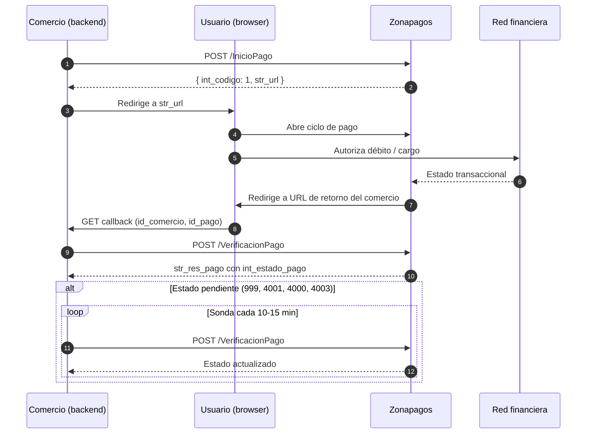

## Actores

<CardGroup cols={2}>
  <Card title="Comercio" icon="store">
    Tu backend y frontend. Inicia pagos, recibe callbacks, verifica estados y entrega el producto.
  </Card>
  <Card title="Usuario pagador" icon="user">
    La persona que compra. Pasa del checkout del comercio al ciclo de pago de Zonapagos.
  </Card>
  <Card title="Zonapagos" icon="arrows-turn-to-dots">
    Orquesta el ciclo transaccional. Hostea el formulario de pago, habla con las redes y notifica al comercio.
  </Card>
  <Card title="Red financiera" icon="building-columns">
    ACH-PSE, franquicias de tarjeta (Credibanco, Redeban), convenios (Bancolombia, Codensa, etc.).
  </Card>
</CardGroup>

## Flujo end-to-end

## Datos que viajan

| En el request a Zonapay | NO se envía | En el response |
|-------------------------|-------------|----------------|
| ID del pedido | ❌ Número de tarjeta | URL del ciclo de pago |
| Monto y descripción | ❌ CVV | Estado final (en VerificacionPago) |
| Datos del cliente (no sensibles) | ❌ Credenciales bancarias | CUS, franquicia, últimos 4 dígitos |
| Configuración del pago | ❌ Tokens bancarios | Datos del pagador |

El usuario digita los datos sensibles directamente en el formulario alojado por Zonapagos o en el sitio del banco. Tu comercio nunca los ve ni los almacena, lo que reduce significativamente tu alcance PCI-DSS.

## Modelos de operación

Zonapay opera bajo los dos modelos de negocio de Zonapagos:

<Tabs>
  <Tab title="Gateway">
    El comercio tiene contrato directo con el banco o franquicia. Zonapay enruta técnicamente.
    
    - Tarifas negociadas directamente con el banco.
    - Liquidación del banco al comercio.
    - Mayor control operativo, mayor responsabilidad en conciliación.
  </Tab>
  <Tab title="Agregador">
    Zonapagos es el titular del contrato con la red. El comercio opera bajo el paraguas.
    
    - Tarifas definidas por Zonapagos.
    - Liquidación de Zonapagos al comercio (T+1 / T+2 típicamente).
    - Habilitación más rápida, menos carga operativa.
  </Tab>
</Tabs>

## ¿Qué hace Zonapay por ti?

<Check>Procesa pagos con múltiples medios en una sola integración.</Check>
<Check>Hostea el ciclo de pago (no necesitas construir formularios con campos de tarjeta).</Check>
<Check>Notifica estados y te entrega datos para reconciliación.</Check>
<Check>Envía al cliente un comprobante del pago por correo.</Check>

## ¿Qué NO hace?

- No gestiona inventario ni reserva stock.
- No envía el email de "gracias por tu compra" con los detalles de tu producto (eso lo envías tú).
- No reintenta automáticamente pagos rechazados (el usuario reintenta desde tu checkout).

## Próximo paso

<CardGroup cols={2}>
  <Card title="Ambientes" icon="server" href="/docs/zonapay/empezar/ambientes">
    URLs y credenciales.
  </Card>
  <Card title="Quickstart" icon="rocket" href="/docs/zonapay/empezar/quickstart">
    Tu primer request en 10 minutos.
  </Card>
</CardGroup>
