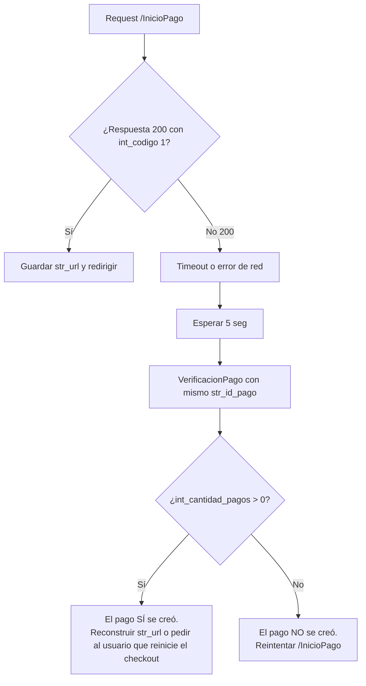

## El problema

Las redes son poco confiables. Un request puede fallar, pero la transacción puede haberse creado. Si reintentas ciegamente, terminas creando **dos pagos para un solo pedido**, y el usuario es cobrado dos veces.

## Principio

<Check>
**Cada pedido tiene UN solo `str_id_pago` que nunca se reutiliza.**
</Check>

<Check>
**Antes de reintentar, verifica si el pago ya existe** con `/VerificacionPago`.
</Check>

## Flujo correcto ante fallo de `/InicioPago`



## Código

```javascript
async function iniciarPagoSeguro(datosRequest) {
  try {
    const { data } = await axios.post(
      `${ZP_API_URL}/InicioPago`,
      datosRequest,
      { timeout: 15000 }
    );
    
    if (data.int_codigo === 1) {
      return { exitoso: true, url: data.str_url };
    }
    
    return { exitoso: false, razon: data.str_descripcion_error };
    
  } catch (err) {
    // Error de red — NO sabemos si el pago se creó o no
    logger.warn("InicioPago con error de red, verificando", {
      str_id_pago: datosRequest.InformacionPago.str_id_pago
    });
    
    // Esperar 5s a que el backend de ZonaPagos termine de escribir (si es que lo hizo)
    await new Promise(r => setTimeout(r, 5000));
    
    const verif = await verificarPago(datosRequest.InformacionPago.str_id_pago);
    
    if (verif.encontrado) {
      // El pago SÍ se creó a pesar del error de red
      logger.info("Pago creado a pesar del error", { 
        str_id_pago: datosRequest.InformacionPago.str_id_pago 
      });
      // No tenemos str_url, hay que pedir al usuario que reinicie
      return { 
        exitoso: false, 
        razon: "Pago en estado desconocido — reinicia el checkout",
        requiere_revision: true
      };
    }
    
    // El pago NO se creó, podemos reintentar con mismo str_id_pago
    throw err;
  }
}
```

## Callback idempotente

El usuario puede recargar tu página de retorno, o ZonaPagos puede disparar el callback dos veces.

```javascript
app.get("/pago/retorno", async (req, res) => {
  const { id_pago } = req.query;
  
  // Idempotencia: solo procesar si el pago aún no está cerrado
  const pago = await db.pagos.findOne({ str_id_pago: id_pago });
  
  if (pago.estado_local === "aprobado") {
    // Ya fue procesado antes — solo redirigir a la página de gracias
    return res.redirect(`/gracias/${pago.id}`);
  }
  
  if (pago.estado_local === "rechazado") {
    return res.redirect(`/pago-rechazado/${pago.id}`);
  }
  
  // Primera vez que llega este callback para este pago
  const estado = await verificarEstado(id_pago);
  await procesarEstado(pago, estado);
  // ...
});
```

## Email de confirmación idempotente

```sql
INSERT INTO emails_enviados (str_id_pago, tipo, enviado_en) 
VALUES ($1, 'confirmacion', NOW())
ON CONFLICT (str_id_pago, tipo) DO NOTHING
RETURNING *;
```

Si la fila ya existía, `RETURNING` viene vacío → no envíes el email de nuevo.

## Entrega de producto idempotente

```javascript
async function entregarProducto(pagoId) {
  const resultado = await db.query(
    `UPDATE pedidos 
     SET estado = 'entregado', dt_entrega = NOW()
     WHERE pago_id = $1 AND estado != 'entregado'
     RETURNING id`,
    [pagoId]
  );
  
  if (resultado.rowCount === 0) {
    logger.info("Pedido ya entregado previamente", { pagoId });
    return;
  }
  
  // Solo llegamos aquí si efectivamente cambió el estado
  await notificarWarehouse(pagoId);
  await enviarEmailEntrega(pagoId);
}
```

## Sonda con lock

Si la sonda se ejecuta en múltiples réplicas, usa un lock distribuido:

```javascript
// Con Redis
const lock = await redis.set("sonda:lock", "1", "EX", 600, "NX");
if (!lock) {
  logger.info("Otra sonda corriendo, saliendo");
  return;
}

try {
  await ejecutarSonda();
} finally {
  await redis.del("sonda:lock");
}
```

## Ver también

<Card title="Manejo de errores" icon="triangle-exclamation" href="/docs/zonapay/guias/manejo-errores">
  Estrategia general de errores.
</Card>
