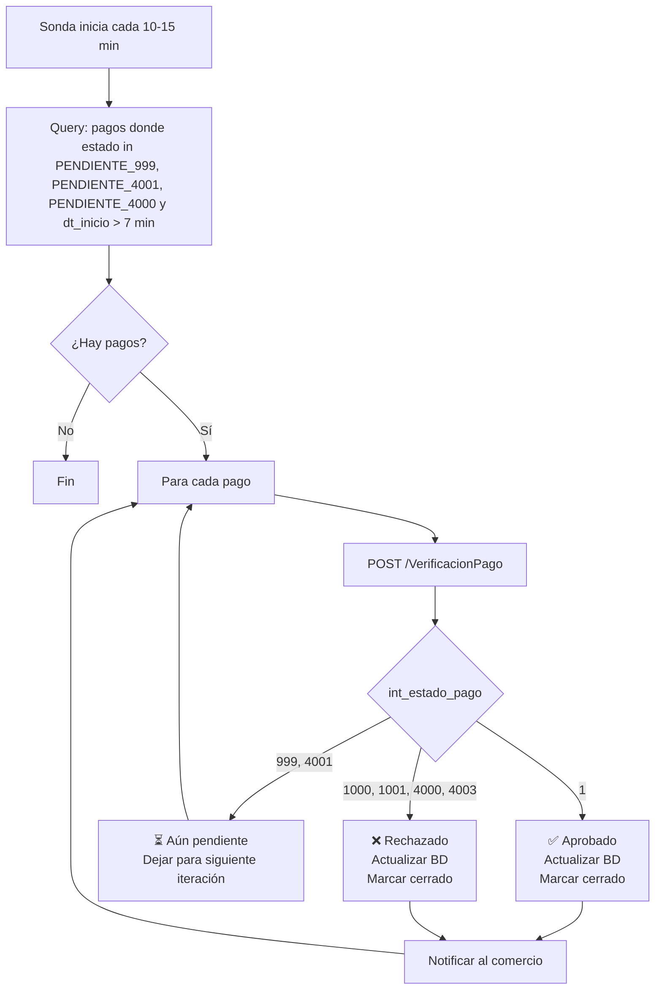

## ¿Qué es la sonda?

La **sonda** (SONDA, cron job, tarea programada) es un proceso en **tu backend** que cada 10-15 minutos consulta `VerificacionPago` para todos los pagos en estado pendiente, y actualiza su estado local cuando recibe respuesta definitiva.

<Warning>
**La sonda es obligatoria para la certificación PSE.** Sin ella, PSE no certifica tu comercio y no puedes operar PSE en producción.
</Warning>

## Por qué es necesaria

PSE y ciertos flujos de tarjeta de crédito no responden de forma síncrona. Un pago puede quedar en estado `999` (pendiente por finalizar) o `4001` (pendiente CR) por varios minutos o incluso horas. Si tu backend no tiene un proceso que consulte periódicamente, **queda desincronizado** con ZonaPagos.

Casos típicos:

- Usuario autoriza débito PSE en el banco, pero el banco demora en confirmar ante ACH.
- Franquicia retiene TC por revisión antifraude (`4001`).
- Pago presencial (GANA, Efecty) — el usuario toma 1-2 días en ir al punto físico.

## Reglas de negocio

<Steps>
  <Step title="Frecuencia estándar: cada 10-15 minutos">
    Para pagos en línea (PSE 29, TC 32, Bancolombia 48, Codensa 51).
  </Step>
  <Step title="Frecuencia reducida: cada 1 hora">
    Para pagos presenciales (`int_id_forma_pago` = 41 PDF, 77 Mefía). Marca estos pagos en tu BD con un flag al detectar el medio.
  </Step>
  <Step title="Solo consultar si han pasado >7 minutos de iniciado el pago">
    Antes de eso, PSE/franquicia aún está procesando. Consultar antes es desperdicio.
  </Step>
  <Step title="Estados definitivos → dejar de consultar">
    Si `int_estado_pago` es `1`, `1000`, `1001`, `4000`, o `4003`, ya no cambiará. Marca el pago como cerrado en tu BD.
  </Step>
  <Step title="Tiempo máximo de reintentos: 1 día y fracción para CR">
    Pasado ese tiempo, las transacciones en `4001` quedan automáticamente rechazadas.
  </Step>
</Steps>

## Diagrama del funcionamiento



## Implementación paso a paso

### 1. Schema de base de datos

Asegúrate de tener estos campos en tu tabla de pagos:

```sql
CREATE TABLE pagos_zonapagos (
  id BIGSERIAL PRIMARY KEY,
  str_id_pago VARCHAR(30) UNIQUE NOT NULL,
  flt_total_con_iva NUMERIC(12, 2) NOT NULL,
  int_id_forma_pago INT,                 -- Lo conoces al primer VerificacionPago
  estado_local VARCHAR(20) NOT NULL,     -- pendiente | aprobado | rechazado
  int_estado_pago_zp INT,                -- El valor de ZonaPagos
  str_codigo_transaccion VARCHAR(100),   -- CUS para PSE
  dt_inicio_pago TIMESTAMP NOT NULL,
  dt_ultima_consulta TIMESTAMP,
  dt_cierre TIMESTAMP,
  es_presencial BOOLEAN DEFAULT false,   -- Para pagos 41, 77 (consulta cada 1h)
  intentos_sonda INT DEFAULT 0,
  respuesta_completa JSONB,              -- str_res_pago parseado
  creado_en TIMESTAMP DEFAULT NOW()
);

CREATE INDEX idx_pagos_pendientes ON pagos_zonapagos(estado_local, dt_inicio_pago)
  WHERE estado_local = 'pendiente';
```

### 2. Query de pagos a consultar

```sql
SELECT id, str_id_pago, dt_ultima_consulta, es_presencial
FROM pagos_zonapagos
WHERE estado_local = 'pendiente'
  AND dt_inicio_pago < NOW() - INTERVAL '7 minutes'
  AND (
    (es_presencial = false AND (dt_ultima_consulta IS NULL OR dt_ultima_consulta < NOW() - INTERVAL '10 minutes'))
    OR
    (es_presencial = true AND (dt_ultima_consulta IS NULL OR dt_ultima_consulta < NOW() - INTERVAL '1 hour'))
  )
ORDER BY dt_inicio_pago ASC
LIMIT 100;
```

### 3. Código de la sonda (Node.js)

```javascript
// sonda.js - correr con cron, k8s CronJob, AWS EventBridge, etc.
import axios from "axios";
import { parseStrResPago } from "./parser.js";

const API_URL = process.env.ZP_API_URL;
const CREDS = {
  int_id_comercio: Number(process.env.ZP_ID_COMERCIO),
  str_usr_comercio: process.env.ZP_USUARIO,
  str_pwd_Comercio: process.env.ZP_CLAVE
};

const ESTADOS_DEFINITIVOS = [1, 1000, 1001, 4000, 4003];

export async function ejecutarSonda(db, logger) {
  const pagosPendientes = await db.query(`
    SELECT id, str_id_pago, es_presencial
    FROM pagos_zonapagos
    WHERE estado_local = 'pendiente'
      AND dt_inicio_pago < NOW() - INTERVAL '7 minutes'
      AND (dt_ultima_consulta IS NULL 
           OR dt_ultima_consulta < NOW() - (CASE WHEN es_presencial THEN INTERVAL '1 hour' 
                                                ELSE INTERVAL '10 minutes' END))
    ORDER BY dt_inicio_pago ASC
    LIMIT 100
  `);

  logger.info(`Sonda: ${pagosPendientes.length} pagos a verificar`);

  for (const pago of pagosPendientes) {
    try {
      const { data } = await axios.post(`${API_URL}/VerificacionPago`, {
        ...CREDS,
        str_id_pago: pago.str_id_pago,
        int_no_pago: -1
      }, { timeout: 15000 });

      await db.query(
        `UPDATE pagos_zonapagos 
         SET dt_ultima_consulta = NOW(), 
             intentos_sonda = intentos_sonda + 1 
         WHERE id = $1`,
        [pago.id]
      );

      if (data.int_estado !== 1 || data.int_error !== 0) {
        logger.warn("Verificación con error", { pago: pago.str_id_pago, data });
        continue;
      }

      if (data.int_cantidad_pagos === 0) {
        // Sin intentos registrados — el usuario nunca inició el pago
        // Si ya pasaron >30min desde inicio, marcar como abandonado
        await marcarAbandonadoSiAplica(db, pago.id);
        continue;
      }

      const intentos = parseStrResPago(data.str_res_pago);
      const ultimo = intentos[intentos.length - 1];
      const estado = Number(ultimo.int_estado_pago);

      // Marcar medio de pago si es la primera vez que lo sabemos
      if (ultimo.int_id_forma_pago) {
        const esPresencial = [41, 77].includes(Number(ultimo.int_id_forma_pago));
        await db.query(
          `UPDATE pagos_zonapagos 
           SET int_id_forma_pago = $1, es_presencial = $2
           WHERE id = $3`,
          [ultimo.int_id_forma_pago, esPresencial, pago.id]
        );
      }

      if (estado === 1) {
        await cerrarComoAprobado(db, pago.id, ultimo);
        await notificarCliente(pago.str_id_pago, "aprobado");
      } else if (ESTADOS_DEFINITIVOS.includes(estado)) {
        await cerrarComoRechazado(db, pago.id, ultimo);
        await notificarCliente(pago.str_id_pago, "rechazado");
      }
      // Si sigue en 999, 4001 → no hacer nada, esperar próxima iteración

    } catch (err) {
      logger.error("Error en sonda", { pago: pago.str_id_pago, error: err.message });
      // No abortar la sonda entera por un pago fallido
    }
  }
}

async function cerrarComoAprobado(db, id, detalle) {
  await db.query(
    `UPDATE pagos_zonapagos 
     SET estado_local = 'aprobado',
         int_estado_pago_zp = $1,
         str_codigo_transaccion = $2,
         dt_cierre = NOW(),
         respuesta_completa = $3
     WHERE id = $4`,
    [detalle.int_estado_pago, detalle.str_codigo_transaccion || null, 
     JSON.stringify(detalle), id]
  );
}
```

### 4. Cómo programarla

<Tabs>
  <Tab title="cron (Linux)">
    ```cron
    # Cada 10 minutos
    */10 * * * * cd /app && node sonda.js >> /var/log/sonda.log 2>&1
    ```
  </Tab>
  <Tab title="Kubernetes CronJob">
    ```yaml
    apiVersion: batch/v1
    kind: CronJob
    metadata:
      name: sonda-zonapagos
    spec:
      schedule: "*/10 * * * *"
      concurrencyPolicy: Forbid
      jobTemplate:
        spec:
          template:
            spec:
              containers:
              - name: sonda
                image: mi-app:latest
                command: ["node", "sonda.js"]
                env:
                  - name: ZP_API_URL
                    value: "https://www.zonapagos.com/Apis_CicloPago/api"
              restartPolicy: OnFailure
    ```
  </Tab>
  <Tab title="AWS EventBridge + Lambda">
    ```yaml
    # serverless.yml
    functions:
      sonda:
        handler: sonda.handler
        timeout: 300
        events:
          - schedule: rate(10 minutes)
    ```
  </Tab>
</Tabs>

## Mensajes obligatorios al usuario

Si un usuario consulta el estado de su pago y recibe `999` o `4001`, **debes mostrar un mensaje específico** (requerimiento PSE). Ver [Mensajes de certificación](/docs/zonapay/guias/certificacion-pse).

## Buenas prácticas

<Check>**`concurrencyPolicy: Forbid`** — evita que dos instancias de la sonda corran simultáneamente y causen race conditions.</Check>
<Check>**Timeout razonable** en el request (15 segundos). Sin timeout, un VerificacionPago lento bloquea toda la sonda.</Check>
<Check>**Paginación implícita** — procesa máximo 100-200 pagos por iteración. Si tienes más pendientes, la siguiente iteración los recoge.</Check>
<Check>**Logs estructurados** — cada consulta con `str_id_pago`, timestamp, resultado. Útil para auditoría PSE.</Check>
<Check>**Alerta si un pago lleva >24h pendiente** — probablemente quedó huérfano. Revisa manualmente.</Check>
<Check>**No elimines pagos pendientes automáticamente.** Cerrarlos como "abandonado" es preferible a borrarlos.</Check>

## Errores comunes

| Síntoma | Causa |
|---------|-------|
| Dos sondas corriendo en paralelo, pagos duplicados | No configuraste `concurrencyPolicy: Forbid` o lock distribuido. |
| Sonda consume el 100% de CPU | Estás consultando el mismo pago cientos de veces. Verifica la query SQL. |
| Estado nunca cambia de `999` | El usuario no completó el pago. Tras >48h, marca como abandonado. |
| Sonda consulta pagos ya cerrados | La query SQL no filtra por `estado_local = 'pendiente'`. |

## Ver también

<CardGroup cols={2}>
  <Card title="Mensajes de certificación" icon="message" href="/docs/zonapay/guias/certificacion-pse">
    Textos obligatorios para 999 y 4001.
  </Card>
  <Card title="Requisitos certificación PSE" icon="list-check" href="/docs/zonapay/guias/certificacion-pse">
    Checklist completo.
  </Card>
</CardGroup>
